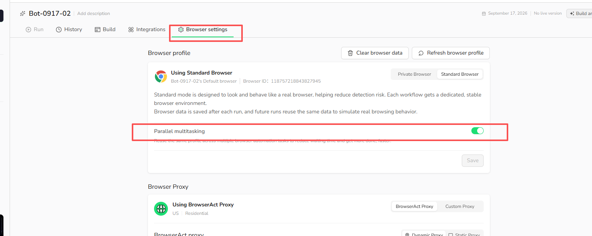

Standard Browser can run supported browser automation tasks in parallel through the `Parallel multitasking` setting. This lets multiple tasks reuse the same saved Browser Profile while reducing wait time between runs.

## How to Enable Parallel Tasks

1. Open `Bots` and select the Bot you want to configure.
2. Select `Browser settings`.
3. Confirm that the Bot is using `Standard Browser`.
4. Turn on `Parallel multitasking`.
5. Select `Save`.

## What to Know

- Each task starts from the latest saved Browser Profile available when the task launches.
- Concurrent tasks reuse the same Browser Profile as their starting point.
- Concurrent runs do not overwrite the saved Browser Profile when they finish.
- Supported entry points include regular Bot runs, Workflow debugging, API, Make, n8n, and Zapier.
- The number of tasks that can run at the same time is still subject to your account's concurrency limits.

Existing Bot data may have this setting turned off by default. Check `Browser settings` before running tasks in parallel.

## When to Use This Setting

Enable `Parallel multitasking` when you need to run multiple tasks from the same stable browser environment and can accept that the tasks share the Browser Profile available at launch.

Keep it turned off when tasks should run one at a time or when their browser state must not be shared as the starting point for other tasks.
